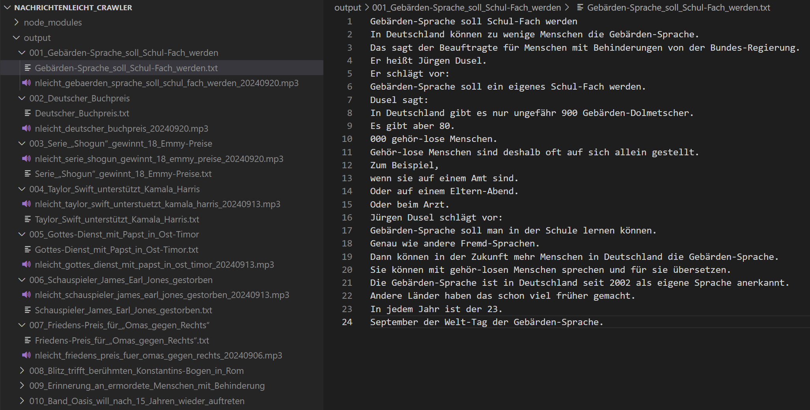

# Nachrichtenleicht Crawler

[中文版本](./docs/README_CN.md)

Nachrichtenleicht Crawler is a web scraping project designed to extract German news articles and audio from the website [nachrichtenleicht.de](https://www.nachrichtenleicht.de/). This crawler helps German learners, particularly at the **A2-B1** level, acquire materials for intensive listening practice.

## Features

- **News Text Scraping**: Fetches the latest German news articles from Nachrichtenleicht, which are written in simple and accessible language, ideal for beginners.
- **Audio Download**: Collects the corresponding audio files for each article, enabling learners to practice listening.
- **Text Formatting**: The scraped text is formatted into a **one-sentence-per-line** structure, making it easier to process for subtitles or other learning tools.

## How to Use

### 1. Install Dependencies

Run the following command in the root directory to install the required dependencies:

```bash
npm i
```

### 2. Scrape News Text and Audio URLs

Use the following command to scrape the latest news text and the URLs of the audio files from the Nachrichtenleicht website:

```bash
node index.js
```

### 3. Download Audio Files

To download the audio files from the scraped URLs, run the following command:

```bash
node audioDownloader.js
```

## Example of Scraped Data

Here is an example of the output from scraping the news articles and audio:


