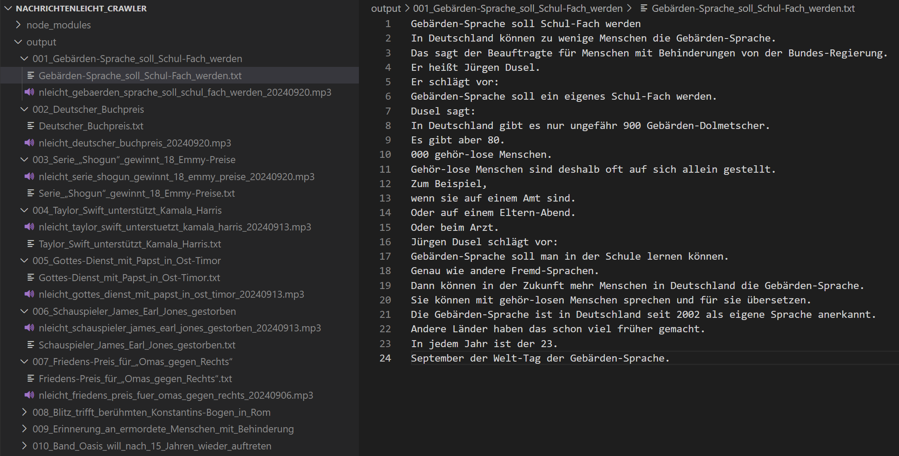

# Nachrichtenleicht Crawler

[English Version](../README.md)

Nachrichtenleicht Crawler 是一个用于爬取 [nachrichtenleicht.de](https://www.nachrichtenleicht.de/) 网站上的德语新闻文本和音频的爬虫项目。这个爬虫可以帮助德语学习者，特别是**A2-B1**水平的学习者，获取用于精听练习的资料。

## 功能介绍

- **新闻文本爬取**: 从 Nachrichtenleicht 网站上获取最新的新闻文本，新闻内容简洁易懂，非常适合德语初学者。
- **音频下载**: 获取相应新闻的音频文件。
- **文本处理**: 爬取的文本会被整理为 **一句一行** 的格式，方便后续加工处理成音频字幕。

## 使用说明

### 1. 安装依赖

在项目根目录下执行以下命令，安装所需的依赖：

```bash
npm i
```

### 2. 爬取新闻文本和音频 URL

使用以下命令来爬取 Nachrichtenleicht 网站上的最新新闻文本以及音频文件的 URL：

```bash
node index.js
```

### 3. 下载音频文件

使用以下命令下载抓取到的音频文件：

```bash
node audioDownloader.js
```


## 爬取结果展示

以下是爬取到的新闻文本与音频的示例：

